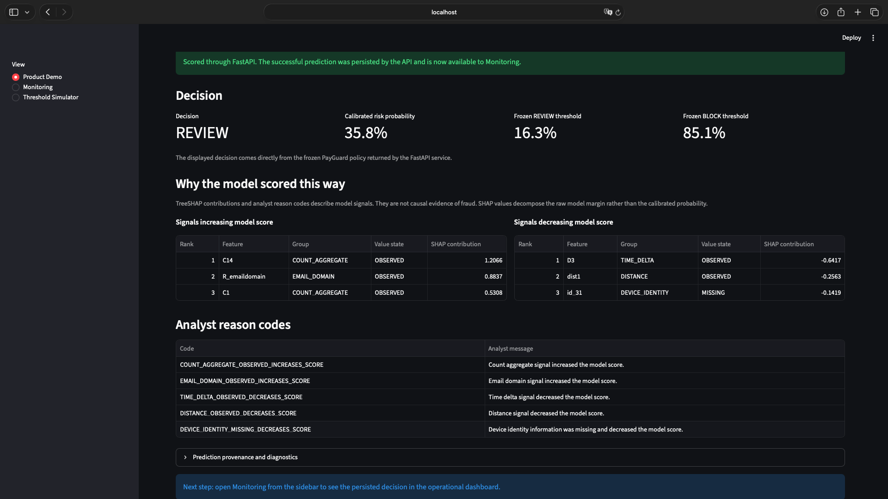
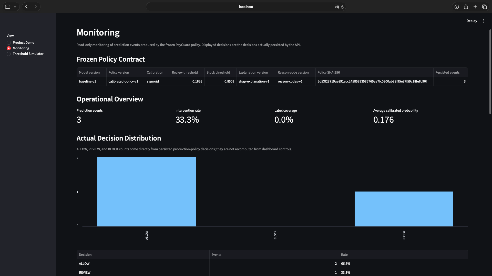
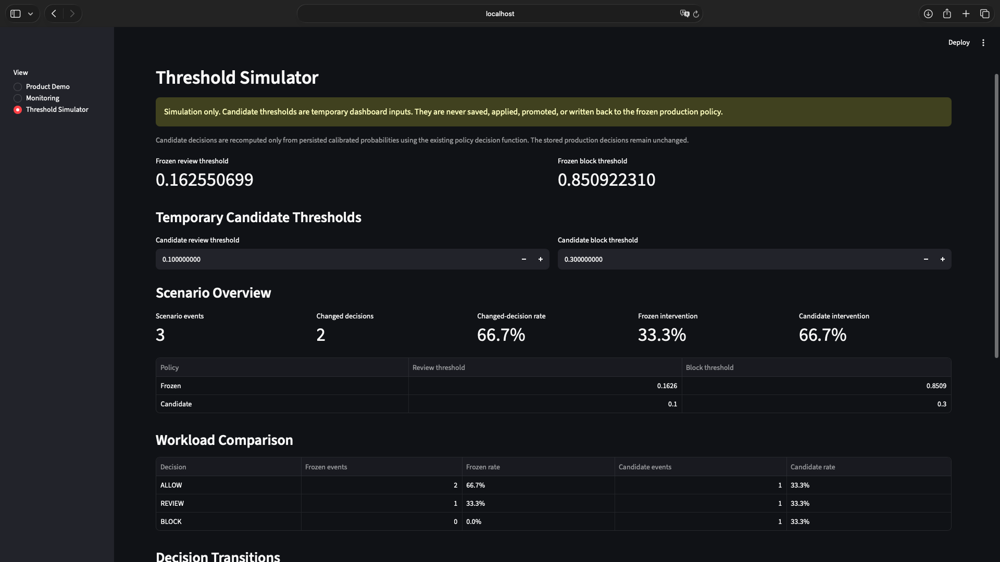

# RiskFlow PayGuard

## Explainable Payment Fraud-Risk Scoring Platform

RiskFlow PayGuard is an end-to-end machine-learning decision system for payment fraud risk, built around the IEEE-CIS Fraud Detection dataset.

It turns a LightGBM model into a controlled product workflow with calibrated probabilities, a frozen `ALLOW` / `REVIEW` / `BLOCK` policy, TreeSHAP explanations, strict API inference, persistence, monitoring, and safe threshold simulation.



*API-backed Product Demo showing a frozen `REVIEW` decision, calibrated fraud-risk probability, decision thresholds, TreeSHAP signals, and analyst reason codes.*

---

## Project at a Glance

| Area | Implementation |
|---|---|
| **Modeling** | LightGBM fraud-risk classifier with chronological train / validation / test evaluation |
| **Decisioning** | Sigmoid probability calibration with frozen `ALLOW` / `REVIEW` / `BLOCK` thresholds |
| **Explainability** | TreeSHAP contributions with deterministic analyst-facing reason codes |
| **Serving** | FastAPI with strict 63-feature validation, single scoring, and ordered batch scoring |
| **Operations** | SQLAlchemy persistence, SQLite / PostgreSQL support, Streamlit monitoring, and read-only threshold simulation |
| **Delivery** | Docker Compose deployment foundation, **454 passing automated tests**, and validated deployment smoke |
| **Test performance** | PR-AUC `0.4946` at `3.48%` fraud prevalence; calibrated log loss `0.1014` |

---

## End-to-End Scoring Path

```text
synthetic transaction
        |
        v
Streamlit Product Demo
        |
        | HTTP POST /predict
        v
FastAPI
        |
        v
strict 63-feature validation
        |
        v
frozen LightGBM baseline-v1
        |
        v
frozen sigmoid calibration
        |
        v
ALLOW / REVIEW / BLOCK policy
        |
        +--------> TreeSHAP explanations
        |          + analyst reason codes
        |
        v
prediction persistence
        |
        v
SQLite or PostgreSQL
        |
        +--------> Monitoring
        |
        +--------> Read-only Threshold Simulator
```

The project emphasizes reproducible inference, calibrated probabilities, policy immutability, explanation integrity, persistence, operational monitoring, containerized deployment, and honest separation between model outputs and confirmed fraud outcomes.

---

## Product Demo

The default Streamlit view provides a guided demonstration of the real scoring path.

A user can:

1. select a deterministic synthetic payment scenario;
2. inspect the complete strict API request;
3. submit it through the live FastAPI `/predict` endpoint;
4. view the calibrated fraud-risk probability and `ALLOW`, `REVIEW`, or `BLOCK` decision;
5. inspect score-increasing and score-decreasing TreeSHAP signals;
6. review analyst-facing reason codes;
7. move to Monitoring and see the persisted prediction event.

The dashboard does **not** load a second model or perform local inference as a fallback. **No local scoring fallback is used.** If FastAPI is unavailable, the Product Demo fails explicitly.

The committed demo transactions are synthetic and have no ground-truth fraud labels. They are demonstration inputs, not examples of confirmed legitimate or fraudulent payments.

---

## Core Capabilities

### Fraud-risk modeling

- chronological train, validation, and test splits;
- deterministic 63-feature contract;
- 29 categorical and 34 numerical features;
- LightGBM binary classifier;
- training-only categorical vocabularies;
- explicit missing and unseen-category handling;
- class weighting and validation-based early stopping;
- PR-AUC, ROC-AUC, log loss, Brier score, recall, precision, and amount-capture evaluation.

### Calibration and decision policy

- sigmoid probability calibration;
- separate calibration-fit and policy-selection validation partitions;
- deterministic `ALLOW`, `REVIEW`, and `BLOCK` thresholds;
- explicit cost assumptions and operational constraints;
- drift diagnostics;
- frozen calibrated-policy artifact;
- overwrite protection and integrity checks.

### Explainability

- native LightGBM TreeSHAP;
- deterministic top positive and negative contributions;
- raw-margin reconstruction validation;
- versioned analyst reason codes;
- observed, missing, and unknown-category states;
- batch-versus-single explanation parity;
- explicit non-causal interpretation warnings.

### API

- FastAPI and Pydantic v2;
- fail-closed frozen-policy loading;
- SHA-256 verification before artifact deserialization;
- strict single and batch request schemas;
- deterministic prediction responses;
- single-versus-batch inference parity;
- ordered batch preservation;
- standard HTTP 422 validation behavior.

Implemented endpoints:

| Method | Path | Purpose |
|---|---|---|
| `GET` | `/health` | Confirm application and frozen-policy startup |
| `GET` | `/model-info` | Expose immutable model, policy, threshold, and feature metadata |
| `POST` | `/predict` | Score, explain, and persist one transaction |
| `POST` | `/batch-predict` | Score, explain, and atomically persist an ordered batch |

### Persistence and monitoring

- SQLAlchemy prediction-event persistence;
- SQLite for native local execution;
- PostgreSQL 16 for the validated Docker Compose stack;
- append-only prediction history;
- frozen provenance stored with each event;
- atomic single and batch writes;
- explicit outcome-label backfill;
- idempotent and conflict-safe label updates;
- decision distribution and intervention monitoring;
- label-coverage reporting;
- reason-code monitoring;
- REVIEW/BLOCK operational queue.

### Threshold simulation

The Streamlit Threshold Simulator evaluates temporary candidate thresholds against persisted calibrated probabilities.

It supports:

- frozen-versus-candidate workload comparison;
- decision-transition analysis;
- operational constraint checks;
- label-gated fraud metrics;
- label-gated development-economics comparison.

It intentionally provides **no save, apply, promote, or write-back workflow**. Candidate thresholds never modify the frozen policy or persisted production decisions.

### Deployment foundation

- hardened Python 3.11 Docker image;
- one application image shared by FastAPI and Streamlit;
- non-root container execution;
- build-time frozen-artifact validation;
- PostgreSQL 16 Docker Compose service;
- health checks for PostgreSQL, FastAPI, and Streamlit;
- persistent PostgreSQL named volume;
- isolated end-to-end deployment smoke validation.

This is a validated local/container deployment foundation, not a claim of public-cloud production readiness.

---

## Frozen Inference Contract

The Phase 5 inference contract is intentionally frozen and remains unchanged by the monitoring, deployment, and portfolio layers.

| Component | Frozen value |
|---|---|
| Baseline model | `baseline-v1` |
| Policy | `calibrated-policy-v1` |
| Calibration | `sigmoid` |
| REVIEW threshold | `0.16255069862369795` |
| BLOCK threshold | `0.8509223095305902` |
| Explanation version | `shap-explanation-v1` |
| Reason-code version | `reason-codes-v1` |
| Policy artifact | `models/payguard_calibrated_policy.joblib` |
| SHA-256 | `5d53f23719ae891ecc24585393585765aa7fc0900ab38f95e37f59c18fe6c90f` |

The runtime verifies the artifact digest before deserialization and validates the embedded model, calibration method, thresholds, and version metadata.

There is no silent fallback to another model or policy.

The frozen artifact is a local runtime artifact and is intentionally excluded from Git.

---

## Quick Start

### Option A — Docker Compose

Prerequisites:

- Docker with Compose support;
- the frozen policy artifact available locally at:

```text
models/payguard_calibrated_policy.joblib
```

Build and start the complete stack:

```bash
docker compose up --build
```

Then open:

```text
Streamlit Product Demo: http://localhost:8501
FastAPI documentation:  http://localhost:8000/docs
FastAPI health:         http://localhost:8000/health
```

The Compose stack runs:

```text
PostgreSQL
FastAPI
Streamlit
```

FastAPI and Streamlit share the same PostgreSQL prediction store. The Product Demo reaches FastAPI through the internal Compose service network.

Stop the stack with:

```bash
docker compose down
```

Remove the local PostgreSQL volume as well:

```bash
docker compose down --volumes
```

### Option B — Native Python

Create and activate a virtual environment:

```bash
python -m venv .venv
source .venv/bin/activate
```

Install dependencies:

```bash
python -m pip install --upgrade pip
python -m pip install -r requirements.txt
```

On macOS, LightGBM may require the OpenMP runtime:

```bash
brew install libomp
```

Start FastAPI:

```bash
python -m uvicorn api.main:app --reload
```

In a second terminal:

```bash
source .venv/bin/activate
python -m streamlit run dashboard/app.py
```

Native execution defaults to:

```text
DATABASE_URL=sqlite:///./predictions.db
PAYGUARD_API_URL=http://localhost:8000
```

Copy `.env.example` to `.env` when you want to override runtime configuration:

```bash
cp .env.example .env
```

The model version, calibration method, thresholds, explanation version, reason-code version, and artifact SHA are **not** configurable through `.env`.

---

## API Example

The repository contains deterministic synthetic payloads that match the complete 63-feature API contract.

With FastAPI running:

```bash
curl -s \
  -X POST \
  http://localhost:8000/predict \
  -H 'Content-Type: application/json' \
  --data @data/sample_payloads/predict_single.json \
  | python -m json.tool
```

Batch example:

```bash
curl -s \
  -X POST \
  http://localhost:8000/batch-predict \
  -H 'Content-Type: application/json' \
  --data @data/sample_payloads/predict_batch.json \
  | python -m json.tool
```

A prediction response includes:

- transaction identifier;
- raw model score;
- calibrated probability;
- frozen policy decision;
- top positive TreeSHAP contributions;
- top negative TreeSHAP contributions;
- analyst reason codes;
- explanation reconstruction diagnostics;
- immutable model and policy provenance.

Successful prediction requests are persisted automatically.

---

## Monitoring Workflow

A simple demonstration sequence is:

```text
1. Open Product Demo
2. Select a synthetic transaction
3. Score transaction
4. Inspect decision and explanation
5. Open Monitoring
6. Confirm the persisted event
7. Open Threshold Simulator
8. Compare temporary candidate thresholds
```

Monitoring only reports fraud-performance or economic metrics when appropriate labels are available.

Unlabeled prediction events are not silently treated as legitimate transactions.

---

## Product Screenshots

### Product Demo — scored REVIEW decision

The primary portfolio screenshot shows the API-backed Product Demo returning a
frozen `REVIEW` decision, calibrated probability, TreeSHAP signals, and analyst
reason codes.


### Monitoring — persisted operational view

The Monitoring view shows that API predictions are persisted and exposed through
an operational dashboard.



### Threshold Simulator — read-only policy analysis

The Threshold Simulator compares temporary candidate thresholds against the
frozen policy without saving, applying, or promoting them.



---

## Architecture

```text
                         RiskFlow PayGuard
                                |
               +----------------+----------------+
               |                                 |
               v                                 v
        Streamlit Dashboard                 FastAPI /docs
               |
     +---------+----------+
     |                    |
     v                    v
Product Demo          Operations
     |                    |
     |             +------+------+
     |             |             |
     |             v             v
     |        Monitoring    Threshold Simulator
     |
     | POST /predict
     v
   FastAPI
     |
     v
Pydantic validation
     |
     v
63-feature contract
     |
     v
baseline-v1 LightGBM
     |
     v
sigmoid calibration
     |
     v
calibrated-policy-v1
     |
     +--------> TreeSHAP
     |
     +--------> reason codes
     |
     v
prediction event
     |
     v
SQLAlchemy
     |
     +------------+
     |            |
     v            v
  SQLite      PostgreSQL
 (native)      (Compose)
```

The Product Demo deliberately calls the API rather than importing the model directly. This keeps one inference path responsible for validation, scoring, explanation generation, policy assignment, and persistence.

---

## Model Results

### Baseline model

The frozen `baseline-v1` LightGBM model was trained on the chronological training split, used validation for early stopping, and was evaluated once against the untouched chronological test split.

| Metric | Validation | Test |
|---|---:|---:|
| PR-AUC | 0.5772 | 0.4946 |
| ROC-AUC | 0.9128 | 0.8808 |
| Log loss | 0.1116 | 0.1300 |
| Brier score | 0.0290 | 0.0336 |
| Fraud prevalence | 3.43% | 3.48% |

At a review capacity equal to the top 1% of test transactions:

- fraud recall: `24.10%`;
- review precision: `83.86%`;
- fraudulent amount capture: `14.16%`.

The test PR-AUC is approximately 14.2 times test fraud prevalence.

The decline from validation to the later chronological test split is treated as a stability/drift signal rather than hidden through random resampling.

See:

- [`docs/phase2_baseline_results.md`](docs/phase2_baseline_results.md)
- [`docs/phase2_baseline_model.md`](docs/phase2_baseline_model.md)

### Calibrated policy

The frozen `calibrated-policy-v1` artifact embeds `baseline-v1`, the sigmoid calibrator, and deterministic decision thresholds.

Final one-time chronological test results:

| Metric | Result |
|---|---:|
| PR-AUC | 0.4946 |
| ROC-AUC | 0.8808 |
| Calibrated log loss | 0.1014 |
| Calibrated Brier score | 0.0238 |
| Review rate | 4.44% |
| Block rate | 0.00% |
| Review precision | 42.49% |
| Fraud intervention recall | 54.23% |
| Fraud amount capture | 21.13% |
| Modeled cost reduction versus all-allow | 19.45% |

Calibration improved test log loss from `0.1300` to `0.1014` and Brier score from `0.0336` to `0.0238`.

No transaction in the final chronological test split exceeded the frozen BLOCK threshold. The recorded test-period policy therefore operated as an `ALLOW`/`REVIEW` policy.

The modeled economic result depends on explicit development assumptions and must not be interpreted as measured production savings.

See:

- [`docs/phase3_results.md`](docs/phase3_results.md)
- [`docs/phase3_calibration_thresholds.md`](docs/phase3_calibration_thresholds.md)

---

## Explanation Design

TreeSHAP explanations are generated from the frozen LightGBM model.

The implementation:

- reconstructs the raw LightGBM margin within strict numerical tolerance;
- leaves the raw score, calibrated probability, decision, and row order unchanged;
- ranks deterministic positive and negative feature contributions;
- maps contributions to stable analyst-facing reason codes.

SHAP contributions explain the model's raw prediction margin.

They do **not** establish why a real transaction was fraudulent, prove causality, or independently validate the calibrated probability.

See:

- [`docs/phase4_results.md`](docs/phase4_results.md)
- [`docs/phase4_explanations_reason_codes.md`](docs/phase4_explanations_reason_codes.md)

---

## Dataset and Feature Contract

RiskFlow PayGuard uses the IEEE-CIS Fraud Detection dataset from Kaggle.

Raw and processed competition data are intentionally excluded from Git.

Expected local structure:

```text
data/
├── raw/
├── processed/
└── sample_payloads/
```

The committed `sample_payloads/` files are deterministic synthetic API/demo requests, not original competition rows.

Chronological development split sizes:

| Split | Rows |
|---|---:|
| Training | 413,378 |
| Validation | 88,581 |
| Test | 88,581 |

The final inference contract contains:

```text
63 total features
29 categorical features
34 numerical features
```

See [`data/README.md`](data/README.md) for data preparation details.

---

## Testing and Validation

Run the full automated test suite:

```bash
python -m pytest -q
```

Validate the Compose definition:

```bash
docker compose config --quiet
```

Run the isolated deployment smoke test:

```bash
python scripts/deployment_smoke.py
```

The deployment smoke test validates:

- image build;
- frozen artifact loading;
- PostgreSQL health;
- FastAPI health;
- Streamlit health;
- frozen `/model-info` metadata;
- prediction persistence;
- typed transaction-ID label backfill;
- direct PostgreSQL verification;
- persistence across container recreation.

---

## Technology Stack

### Application and analytics

- Python
- pandas
- NumPy
- PyArrow
- scikit-learn
- LightGBM
- joblib
- SHAP / native LightGBM TreeSHAP

### Service and validation

- FastAPI
- Uvicorn
- Pydantic v2
- httpx

### Persistence and UI

- SQLAlchemy
- SQLite
- PostgreSQL 16
- Streamlit

### Delivery and quality

- Docker
- Docker Compose
- pytest

---

## Project Structure

```text
api/          FastAPI service, request schemas, frozen-policy loading,
              scoring integration, persistence, and outcome labeling

dashboard/    Product Demo, monitoring queries/views, and read-only
              threshold simulation

data/         Local raw/processed data plus committed synthetic demo payloads

db/           Prediction-log database components

docs/         Phase architecture, implementation records, and model results

models/       Local serialized model/policy artifacts

notebooks/    Exploratory and analytical notebooks

scripts/      Deployment and operational validation utilities

src/          Feature engineering, preprocessing, modeling, calibration,
              policy evaluation, explainability, and bundle utilities

tests/        Automated unit, integration, API, dashboard, persistence,
              immutability, and deployment-support tests
```

---

## Development Phases

| Phase | Status | Deliverable |
|---|---|---|
| Phase 1 | Complete | Data setup, EDA, feature engineering, and chronological datasets |
| Phase 2 | Complete | LightGBM baseline, evaluation, and versioned model bundle |
| Phase 3 | Complete | Probability calibration, drift diagnostics, and decision policy |
| Phase 4 | Complete | TreeSHAP explanations and versioned reason codes |
| Phase 5 | Complete | Strict FastAPI inference over the frozen policy |
| Phase 6 | Complete | Persistence, monitoring, outcome labeling, and threshold simulation |
| Phase 7 | Complete | Docker/PostgreSQL deployment foundation and deployment smoke |
| Phase 8 | Complete | Guided Product Demo, portfolio documentation, and presentation assets |

Detailed implementation records:

- [`docs/phase5_api_integration.md`](docs/phase5_api_integration.md)
- [`docs/phase6_monitoring_dashboard.md`](docs/phase6_monitoring_dashboard.md)
- [`docs/phase7_deployment.md`](docs/phase7_deployment.md)
- [`docs/phase8_portfolio_demo.md`](docs/phase8_portfolio_demo.md)
- [`docs/README.md`](docs/README.md)

---

## Current Limitations

RiskFlow PayGuard is a portfolio/development system and should not be treated as a deployed payment authorization platform.

Current limitations include:

- development cost assumptions are not validated against real production economics;
- no final-test transaction reached the frozen BLOCK threshold;
- SHAP contributions and reason codes describe model behavior but are not causal evidence;
- SHAP values decompose the raw model margin rather than the calibrated probability;
- no dedicated high-value-fraud optimization objective;
- no public-cloud release;
- no authentication or rate limiting;
- no production traffic or latency validation;
- no automated monitoring-alert engine;
- no automated ground-truth outcome-ingestion pipeline;
- no schema-migration framework is configured yet;
- no automated retraining workflow;
- no formal policy-approval or model-risk-governance process.

PostgreSQL has been validated through the Docker Compose deployment smoke test. Future schema changes should introduce migration tooling before altering the persisted schema.

The frozen `baseline-v1` and `calibrated-policy-v1` artifacts are benchmarks and must remain unchanged unless a future version is deliberately introduced as a separate artifact and policy.

---

## Future Product Work

Potential work beyond the current portfolio demonstration includes:

- public-cloud deployment;
- authentication and rate limiting;
- monitoring alerts;
- automated outcome ingestion;
- database migration tooling;
- stronger operational observability;
- policy approval/governance workflows;
- separately versioned future models rather than mutation of the frozen benchmark.

These are intentionally outside the current Phase 8 implementation scope.

---

## License

MIT
