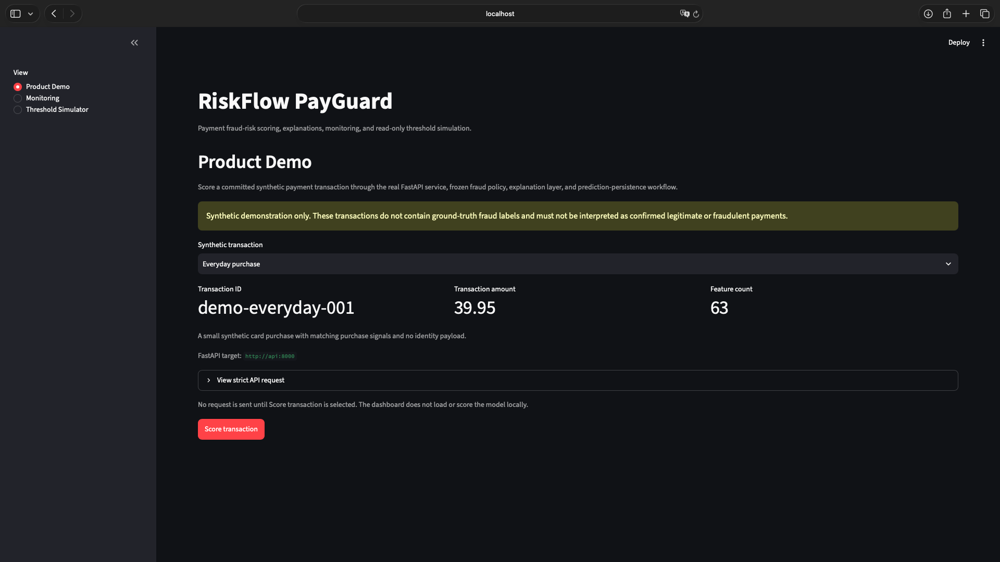

# Phase 8 — Portfolio Polish and Product Demonstration

## Status

Phase 8 is complete.

The completed phase includes:

- deterministic synthetic API payloads;
- an API-backed Streamlit Product Demo;
- portfolio-focused root documentation;
- a guided demonstration and presentation record;
- real screenshots captured from the running application;
- final regression and deployment verification.

This document records the Phase 8 demonstration workflow, presentation strategy,
frozen-contract guarantees, verification evidence, and the boundary between the
implemented local product and future production infrastructure.

A recorded Loom or portfolio video remains optional and is not required for
Phase 8 completion.

Phase 8 does not retrain, recalibrate, retune, overwrite, or promote any model
or policy artifact.

It also does not claim that RiskFlow PayGuard is a public-cloud production
payment authorization system.

## Phase 8 Objectives

Phase 8 turns the existing engineering system into a project that can be
understood and demonstrated quickly by someone unfamiliar with the repository.

The intended portfolio journey is:

~~~text
What is PayGuard?
      |
      v
How does the architecture work?
      |
      v
Score a synthetic transaction
      |
      v
Inspect the frozen decision
      |
      v
Understand model signals
      |
      v
Confirm persistence in Monitoring
      |
      v
Explore a read-only threshold scenario
      |
      v
Understand production limitations
~~~

The phase emphasizes product communication and demonstration rather than new
inference capabilities.

## Frozen Contract

The Phase 8 presentation layer remains downstream of the frozen inference
contract.

| Component | Value |
|---|---|
| Baseline model | `baseline-v1` |
| Policy | `calibrated-policy-v1` |
| Calibration | `sigmoid` |
| REVIEW threshold | `0.16255069862369795` |
| BLOCK threshold | `0.8509223095305902` |
| Explanation version | `shap-explanation-v1` |
| Reason-code version | `reason-codes-v1` |
| Policy SHA-256 | `5d53f23719ae891ecc24585393585765aa7fc0900ab38f95e37f59c18fe6c90f` |

Frozen artifact:

~~~text
models/payguard_calibrated_policy.joblib
~~~

Phase 8 must not:

- retrain the baseline model;
- recalibrate probabilities;
- modify policy thresholds;
- overwrite the frozen artifact;
- change inference semantics;
- introduce a silent scoring fallback;
- allow the threshold simulator to mutate the frozen policy.

## Product Demonstration Architecture

The implemented demonstration path is:

~~~text
                    RiskFlow PayGuard
                           |
                           v
                   Streamlit Dashboard
                           |
             +-------------+-------------+
             |                           |
             v                           v
       Product Demo                 Operations
             |                           |
             |                    +------+------+
             |                    |             |
             v                    v             v
      POST /predict          Monitoring    Threshold
             |                             Simulator
             v
          FastAPI
             |
             v
    strict Pydantic validation
             |
             v
       63-feature contract
             |
             v
    frozen baseline-v1 model
             |
             v
      sigmoid calibration
             |
             v
   calibrated-policy-v1
             |
       +-----+------+
       |            |
       v            v
   TreeSHAP     reason codes
       |
       v
 prediction response
       |
       v
 persistence through API
       |
       +--------------+
       |              |
       v              v
    SQLite        PostgreSQL
   (native)       (Compose)
~~~

The Product Demo deliberately uses the existing HTTP API.

It does not import the model directly for scoring and does not duplicate the
prediction pipeline.

This preserves a single path for:

- request validation;
- feature contract enforcement;
- model scoring;
- probability calibration;
- policy assignment;
- explanation generation;
- reason-code generation;
- persistence.

If FastAPI is unavailable, the Product Demo displays an explicit error.

No local scoring fallback is used.

## Demonstration Inputs

Committed deterministic demonstration payloads are located under:

~~~text
data/sample_payloads/
├── predict_single.json
└── predict_batch.json
~~~

The Product Demo currently exposes three bounded synthetic scenarios:

| Transaction ID | Scenario | Frozen decision |
|---|---|---|
| `demo-everyday-001` | Everyday purchase | `ALLOW` |
| `demo-higher-value-002` | Higher-value purchase | `REVIEW` |
| `demo-mobile-identity-004` | Mobile identity-rich purchase | `ALLOW` |

The committed single-prediction example uses the higher-value scenario because
a REVIEW decision makes the explanation and analyst workflow more visible in a
short demonstration.

These examples are synthetic.

They do not contain ground-truth fraud labels and must not be described as
confirmed fraud or confirmed legitimate transactions.

The scenarios were selected from a bounded set of pre-defined synthetic
profiles. They were not iteratively optimized to manufacture a desired frozen
decision.

## Guided Product Demo

The default Streamlit view is `Product Demo`.

The user selects one committed synthetic transaction and can inspect:

- transaction ID;
- transaction amount;
- complete feature count;
- scenario description;
- target FastAPI URL;
- strict API request payload.

No request is submitted until the user selects:

~~~text
Score transaction
~~~

The dashboard then calls:

~~~text
POST /predict
~~~

through FastAPI.

A successful response displays:

- frozen `ALLOW`, `REVIEW`, or `BLOCK` decision;
- calibrated risk probability;
- frozen REVIEW threshold;
- frozen BLOCK threshold;
- score-increasing TreeSHAP contributions;
- score-decreasing TreeSHAP contributions;
- analyst reason codes;
- model and policy provenance;
- reconstruction diagnostics.

The successful API request is also persisted.

The Product Demo then directs the user to Monitoring so the same prediction can
be seen as an operational event.

## Explanation Interpretation

TreeSHAP and reason codes explain model behavior.

They are not causal evidence that a transaction is fraudulent.

The displayed SHAP values decompose the LightGBM raw model margin rather than
the calibrated probability.

The demonstration should therefore use language such as:

- "signals increasing the model score";
- "signals decreasing the model score";
- "analyst reason codes";
- "model explanation";

and avoid unsupported language such as:

- "proof of fraud";
- "the transaction is fraudulent because...";
- "the model discovered the true cause".

## Monitoring Demonstration

The `Monitoring` view reads persisted prediction events.

The recommended demonstration flow is:

~~~text
1. Score the higher-value synthetic transaction
2. Open Monitoring
3. Confirm the event count increased
4. Inspect the frozen policy provenance
5. Inspect the decision distribution
6. Inspect calibrated-score monitoring
7. Inspect reason-code frequency
8. Inspect the recent REVIEW / BLOCK queue
9. Note the outcome-label coverage
~~~

Monitoring reports the decisions actually persisted by the API.

It does not recompute production decisions from dashboard controls.

If prediction events are unlabeled, the dashboard reports label coverage but
does not invent fraud recall, fraud precision, fraud capture, or economic
performance.

## Threshold Simulator Demonstration

The `Threshold Simulator` is deliberately read-only with respect to the frozen
policy.

The user may enter temporary candidate REVIEW and BLOCK thresholds.

The simulator then recomputes candidate decisions from persisted calibrated
probabilities using the existing policy decision function.

It can show:

- scenario event count;
- changed-decision count and rate;
- frozen versus candidate intervention rates;
- workload comparison;
- decision transitions;
- operational constraint feasibility.

Fraud and development-economics metrics are shown only when sufficient labeled
events and transaction amounts are available.

Candidate thresholds are never:

- saved;
- applied;
- promoted;
- written back to the frozen artifact;
- written back to persisted production decisions.

A useful portfolio explanation is:

> The simulator lets an analyst study the operational consequences of a
> threshold change without changing the currently frozen decision policy.

## Recommended End-to-End Demonstration

A concise live demonstration should follow this order.

### 1. Product positioning

Start from the root README and explain that PayGuard is not only a fraud-model
notebook.

It combines:

- modeling;
- calibration;
- deterministic policy;
- explanations;
- API inference;
- persistence;
- monitoring;
- safe threshold simulation;
- containerized deployment.

### 2. Start the stack

For the complete containerized demonstration:

~~~bash
docker compose up --build
~~~

Then open:

~~~text
Streamlit: http://localhost:8501
FastAPI:   http://localhost:8000
API docs:  http://localhost:8000/docs
~~~

### 3. Show Product Demo

Select:

~~~text
Higher-value purchase
~~~

Open the strict request payload briefly to demonstrate the complete 63-feature
contract.

Then select:

~~~text
Score transaction
~~~

### 4. Explain the decision

Point out:

- the calibrated probability;
- the frozen REVIEW threshold;
- the REVIEW decision;
- positive and negative TreeSHAP signals;
- analyst reason codes.

Emphasize that the decision is returned by FastAPI using the frozen policy.

### 5. Show persistence

Move to Monitoring.

Show that the scored transaction now appears in persisted operational data.

### 6. Show safe policy exploration

Move to Threshold Simulator.

Adjust one candidate threshold enough to demonstrate workload or decision
changes.

Explain that this is a temporary scenario and does not mutate the frozen policy.

### 7. Close with engineering boundaries

Finish by noting that:

- PostgreSQL is validated through Docker Compose;
- the deployment is local/containerized rather than public cloud;
- authentication, rate limiting, alerting, automated ground-truth ingestion,
  migration tooling, and model governance remain future concerns.

## Screenshot Capture Record

The portfolio screenshots were captured from the running product after the UI
was stabilized.

No placeholder or generated screenshots are used as evidence of the
application.

Final asset directory:

~~~text
docs/assets/
~~~

The captured set is:

### `phase8_product_demo_input.png`

Captured before scoring and shows:

- sidebar navigation;
- selected synthetic scenario;
- transaction ID;
- amount;
- feature count;
- `Score transaction` button.

Purpose:

Show that the project has a guided product-facing entry point rather than only
an API or notebook.

### `phase8_product_demo_result.png`

Captured after scoring the higher-value synthetic scenario and shows:

- the frozen `REVIEW` decision;
- calibrated probability;
- frozen thresholds;
- positive and negative TreeSHAP signals;
- analyst reason codes.

Purpose:

Serve as the primary portfolio screenshot and show scoring plus explainability
in one product view.

### `phase8_monitoring.png`

Captured after three deterministic demo transactions were persisted and shows:

- frozen policy provenance;
- operational overview;
- actual decision distribution;
- unlabeled outcome coverage.

Purpose:

Show that inference results flow into a persisted operational monitoring layer.

### `phase8_threshold_simulator.png`

Captured with temporary candidate thresholds that visibly change the simulated
workload and decisions.

The simulation-only warning remains visible.

Purpose:

Demonstrate safe decision-policy analysis without presenting the simulator as a
policy-editing screen.

A separate `phase8_reason_codes.png` capture was intentionally omitted because
the primary Product Demo result already presents the analyst reason codes and
their explanation context clearly.

## Screenshot Quality Rules

Before capturing portfolio screenshots:

- run the application with a clean, intentional demonstration dataset;
- avoid exposing local secrets, environment values, or unrelated browser tabs;
- use a consistent browser width;
- keep the Streamlit sidebar visible when it helps explain navigation;
- avoid tiny text caused by excessive browser zoom-out;
- prefer one clear concept per screenshot;
- do not crop away warnings that materially qualify the displayed result;
- do not present synthetic transactions as labeled fraud examples.

The primary portfolio image should communicate the product within a few seconds
without requiring the viewer to inspect source code.

## Captured Phase 8 Assets

The following screenshots were captured from the running RiskFlow PayGuard
application using deterministic synthetic demo transactions.

### `assets/phase8_product_demo_input.png`

Product Demo before a scoring request is submitted.

### `assets/phase8_product_demo_result.png`

Primary portfolio screenshot showing the higher-value synthetic transaction
returning a frozen `REVIEW` decision, explanation signals, and analyst reason
codes.

### `assets/phase8_monitoring.png`

Monitoring after three deterministic demo transactions were scored and
persisted.

### `assets/phase8_threshold_simulator.png`

Temporary threshold scenario showing workload and decision changes without
mutating the frozen policy.

A separate reason-code screenshot was intentionally omitted because the primary
Product Demo result already presents the analyst reason-code section clearly.

## Loom / Portfolio Video Plan

A concise product video should target roughly two to four minutes rather than a
long technical walkthrough.

Suggested structure:

### Opening — approximately 20 seconds

Explain:

"RiskFlow PayGuard is an end-to-end payment fraud-risk scoring project. A
transaction is validated by FastAPI, scored by a frozen LightGBM model,
calibrated, converted into an ALLOW/REVIEW/BLOCK policy decision, explained
with TreeSHAP and reason codes, persisted, and then exposed through monitoring
and safe threshold simulation."

### Product Demo — approximately 60 seconds

Show:

- scenario selection;
- strict request;
- score action;
- calibrated probability;
- REVIEW decision;
- TreeSHAP signals;
- reason codes.

Mention that the Streamlit page is calling the real FastAPI `/predict`
endpoint.

### Monitoring — approximately 30 to 45 seconds

Show the persisted event and operational dashboard.

Explain the separation between prediction monitoring and ground-truth outcomes.

### Threshold Simulator — approximately 30 to 45 seconds

Adjust a temporary threshold and show workload changes.

State clearly that the candidate thresholds cannot be saved or promoted.

### Closing — approximately 20 seconds

Summarize:

- frozen model/policy integrity;
- API-backed demo;
- SQLite/PostgreSQL portability;
- Docker Compose deployment;
- current production limitations.

## Portfolio Talking Points

For a Data Engineering or Analytics Engineering audience, emphasize:

- deterministic feature and API contracts;
- model artifact integrity;
- append-only persistence;
- SQLite/PostgreSQL portability;
- deployment smoke validation;
- operational monitoring;
- separation of inference and analytical simulation.

For a Data Science audience, emphasize:

- chronological evaluation;
- calibration;
- policy selection;
- drift awareness;
- TreeSHAP explanations;
- frozen test results;
- separation of modeling probabilities from operational decisions.

For an ML Engineering audience, emphasize:

- frozen artifact verification;
- inference parity;
- strict schemas;
- single versus batch determinism;
- API-backed product integration;
- deployment health checks;
- fail-closed startup;
- no silent model fallback.

## Implemented Phase 8 Commits

The Phase 8 implementation was built through isolated commits:

~~~text
9f822b4  feat(demo): add deterministic API sample payloads
384767d  feat(demo): add API-backed product demonstration
68741b7  docs: reframe README for product demonstration
267da47  docs: add Phase 8 demo and presentation guide
d4bd74d  docs: add Phase 8 product screenshots
~~~

The final documentation-only completion commit marks the phase complete after
the full regression and deployment verification gates pass.

## Phase 8 Completion Boundary

Phase 8 is intended to make the existing product easy to understand,
demonstrate, and evaluate.

It does not introduce:

- Kubernetes;
- Terraform;
- Redis;
- Celery;
- reverse-proxy infrastructure;
- authentication;
- automated retraining;
- automated policy promotion;
- monitoring-alert infrastructure;
- database schema changes.

Those concerns should be introduced only when a later phase has a clear product
requirement for them.

## Public Cloud Boundary

The existing Docker image and PostgreSQL-backed Compose deployment provide a
foundation for future managed deployment.

A future cloud topology could use:

~~~text
container registry
      |
      +----> FastAPI service
      |
      +----> Streamlit service

managed PostgreSQL
      ^
      |
      +---- FastAPI
      |
      +---- Streamlit
~~~

Phase 8 does not choose or provision a cloud provider.

It also does not solve:

- production secrets;
- TLS;
- authentication and authorization;
- rate limiting;
- backups;
- alerting;
- production observability;
- production traffic validation;
- model-risk governance.

These remain explicit future product concerns rather than hidden omissions.

## Final Verification Baseline

Before marking Phase 8 complete, the finished branch passed:

~~~text
docker compose config --quiet
PASS

python -m pytest -q
454 passed

python scripts/deployment_smoke.py
deployment smoke: PASS
~~~

The deployment smoke verified:

- PostgreSQL health;
- FastAPI health;
- Streamlit health;
- frozen `/model-info` metadata;
- PostgreSQL prediction persistence;
- typed outcome-label backfill;
- direct PostgreSQL verification;
- persistence across container recreation.

The frozen policy digest remained:

~~~text
5d53f23719ae891ecc24585393585765aa7fc0900ab38f95e37f59c18fe6c90f
~~~

Phase 8 therefore completes without retraining, recalibration, threshold
changes, artifact overwrite, or inference-semantic changes.

## Phase 8 Completion Criteria

Phase 8 is complete because:

- the demonstration workflow is documented;
- the Product Demo uses the real FastAPI inference path;
- no local scoring fallback exists;
- deterministic synthetic examples are clearly identified as unlabeled;
- prediction events persist into Monitoring;
- the Threshold Simulator remains read-only;
- real application screenshots are committed as portfolio evidence;
- the primary Product Demo screenshot includes analyst reason codes;
- a concise optional portfolio-video walkthrough is defined;
- the public-cloud boundary remains explicit;
- the complete automated suite passes;
- the deployment smoke passes;
- the frozen inference contract remains unchanged;
- the documentation index links to this Phase 8 record.

Any future product work should be introduced as a separately scoped phase rather
than silently extending or mutating the completed Phase 8 contract.
